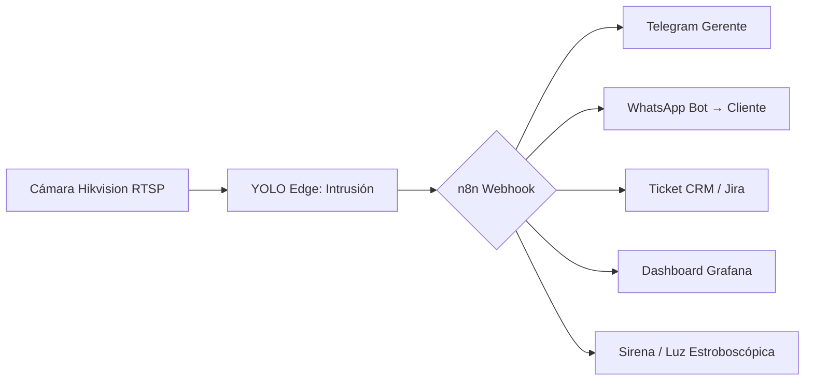

## El problema: sus cámaras vigilan, pero no **auditan**

La mayoría de empresas en Bogotá tienen CCTV. Pero cuando ocurre un robo, una discrepancia en caja o un incidente de seguridad, la respuesta es: *"la cámara no grabó bien"*, *"la imagen es borrosa de noche"*, *"nadie revisó las horas de video"*.

**La diferencia entre vigilar y auditar:**
| Vigilar (CCTV tradicional) | Auditar (CCTV + IA YOLO) |
|---------------------------|--------------------------|
| Graba video 24/7 | Analiza cada frame en tiempo real |
| Humano ve pantallas | IA detecta y alerta en segundos |
| Revisión manual horas | Clip del evento en 30 seg (WhatsApp/Telegram) |
| "¿Qué pasó anoche?" | "Intrusión detectada 02:13 - clip adjunto" |
| Ciego de noche | ColorVu 4K: ve placas y rostros a las 2am |

---

## ¿Qué es exactamente la analítica de video con IA (YOLO)?

**YOLO (You Only Look Once)** es una arquitectura de detección de objetos en tiempo real. Procesa cada frame de video y devuelve: *qué hay, dónde está, con qué confianza*.

En Servicios APC **no vendemos cámaras**. Tomamos sus cámaras Hikvision/Dahua actuales (RTSP/ONVIF), les inyectamos módulos YOLOv8/v10 en su red local (edge), y convertimos el video en **datos accionables**:

- **Conteo de personas** → aforo, mapas de calor, ocupación por zona
- **Detección de intrusión** → perímetros virtuales, alerta instantánea
- **Arqueo de caja asistido** → video del cajón + monto detectado por IA
- **Detección PPE** → casco, chaleco, guantes, gafas en obra/fábrica
- **Mapas de calor** → zonas muertas, cuellos de botella, recorrido cliente
- **Detección de caídas** → clínicas, residencias, alerta <30 seg a enfermería

---

## Compatibilidad: ¿Funciona con MIS cámaras Hikvision?

**Sí, si soportan RTSP u ONVIF (Profile S/G/T).** La inmensa mayoría de modelos Hikvision 2018+ lo cumplen:

| Serie Hikvision | Compatible | Comentario |
|----------------|------------|------------|
| **ColorVu 4K / 4MP** | ✅ 100% | Visión nocturna a color real → ideal placas/rostros 2am |
| **AcuSense 2MP/4MP** | ✅ 100% | Filtrado falso positivo (persona/vehículo) → mejor ROI |
| **DeepinView** | ✅ 100% | IA embebida en cámara (conteo, PPE, cola) → máxima precisión |
| **Serie 2xx / 4xx / 5xx / 7xx / 8xx (2018+)** | ✅ RTSP/ONVIF | Reprogramamos stream → inyectamos YOLO en edge |
| **Modelos pre-2017** | ⚠️ Verificar | Algunos solo MPEG-4 → puede requerir upgrade |

**También funciona con Dahua, Uniview, Axis, Hanwha, TP-Link VIGI** — cualquier cámara con stream RTSP/ONVIF Profile S/G/T.

> **¿No está seguro?** Envíenos el modelo exacto → le confirmamos gratis en 24h.

---

## Arquitectura: Offline-First = Cero pérdida aunque se caiga internet

```
[Cámaras Hikvision RTSP] 
       ↓ (red local)
[Servidor Edge / NVR + GPU] → YOLOv8/v10 (inferencia local)
       ↓
[Alertas instantáneas] → Telegram / WhatsApp / Email (si hay internet)
       ↓
[Dashboard Web] → Mapas calor, conteos, arqueos, alertas históricas
       ↓ (cuando hay internet)
[Nube / N8N] → Sincronización, reportes PDF/Excel, backup
```

**Si se corta internet:** la IA sigue corriendo en local (edge). Cuenta personas, detecta intrusos, arquea cajas. Cuando vuelve la señal, sincroniza todo automático. **Nada se pierde.**

---

## Casos reales Bogotá (clientes Servicios APC)

### 1. Ferretería El Progreso — Suba, Bogotá
**Problema:** Robos nocturnos, cámaras borrosas, placas ilegibles.
**Solución:** Hikvision ColorVu 4K ColorVu + YOLO detección placas + alerta Telegram.
**Resultado:** Recuperaron 3 bultos robados en 48h. Placa legible a las 2am. Cero falsos positivos.
> *"Por primera vez la Policía tuvo una prueba real. Antes solo teníamos sombras."*

### 2. Clínica Dental Sonrisa Viva — Chapinero, Bogotá
**Problema:** Control aforo salas espera, normativa HIPAA/Ley 1581, caídas pacientes.
**Solución:** Hikvision 2MP WDR + YOLO aforo + detección caídas + zonas restringidas (RX, esterilización).
**Resultado:** Cumplimiento normativo 100%. Alerta caída → enfermería <30 seg. Cero incidentes zona RX.
> *"La alerta de caída llegó al celular de enfermería antes de que el paciente gritara."*

### 3. Distribuidora Jone — Bodega + SEO Local Bogotá
**Problema:** Puntos ciegos bodega, 0 cotizaciones orgánicas web.
**Solución:** YOLO sobre Hikvision existentes + CCTV nuevo ColorVu bodega + SEO Local Google Maps + WhatsApp Bot embudos.
**Resultado:** Visibilidad 100% bodega. **+340% cotizaciones orgánicas Bogotá**. Bot atiende 80% consultas sin humano.

---

## Modelos Hikvision recomendados para IA (2026)

| Necesidad | Modelo recomendado | Por qué |
|-----------|-------------------|---------|
| **Visión nocturna real (placas/rostros 2am)** | **ColorVu 4K / 4MP** | Sensor 1/1.2", apertura F1.0, luz suplementaria cálida → color real 0 lux |
| **Mejor costo/beneficio (filtrado falsos positivos)** | **AcuSense 2MP / 4MP** | Algoritmo persona/vehículo en cámara → reduce 90% falsos positivos |
| **Máxima precisión (conteo, PPE, cola, PPE)** | **DeepinView** | IA embebida (conteo, PPE, cola, heatmap) → precisión 98%+ |
| **Presupuesto ajustado + IA en edge** | Serie 2xx/4xx (2018+) + Edge Server | Reutiliza cámaras actuales + servidor GPU local |

> **Consejo:** Para analítica YOLO en edge, recomendamos **ColorVu 4K** o **AcuSense 4MP** + servidor edge con GPU NVIDIA (T4 / A2000 / RTX 4000). Costo total ≈ 40% menos que DeepinView full.

---

## Alertas reales: ¿Cómo se ven en su celular?

```
🚨 ALERTA: INTRUSIÓN PERIMETRAL
📍 Zona: Bodega Principal - Puerta 3
🕐 2026-07-24 02:13:45
🎯 Objeto: Persona (confianza 94%)
📎 Clip: [Ver video 10s]
📍 Mapa: [Abrir en Google Maps]
⚡ Acciones: [Llamar Policía] [Activar Sirena] [Ver Live]
```

Recibe en **Telegram, WhatsApp Business, Email** simultáneo. Dashboard web con histórico, filtros, exportación PDF/Excel.

---

## Integración n8n: CCTV → Alerta → Acción automática



**Ejemplos reales:**
- Intrusión bodega → Telegram gerente + Sirena + Ticket CRM
- Aforo excedido tienda → WhatsApp gerente + Ajuste HVAC automático
- Arqueo discrepante → Email contador + Alerta WhatsApp dueño
- Caída detectada clínica → Telegram enfermería + Llamada SIP

---

## Preguntas frecuentes (FAQ)

### ¿Tengo que cambiar todas mis cámaras?
No. Si sus Hikvision/Dahua tienen RTSP/ONVIF (mayoría 2018+), reprogramamos el stream e inyectamos YOLO. **Costo 0€ en cámaras nuevas.**

### ¿Qué pasa si se va la luz o internet?
Arquitectura **Offline-First**: IA corre en edge (su red local). Sigue contando, detectando, arqueando. Sincroniza al volver señal. **Cero pérdida.**

### ¿La IA escucha conversaciones privadas?
No. Audio IA solo se activa por disparador (ej. sonido cajón apertura) por segundos. Resto del tiempo: **privacy by design**.

### ¿Cómo veo las alertas en mi celular?
Telegram, WhatsApp Business, Email simultáneo. Dashboard web responsive (sin app extra). Clip de video 10s adjunto.

### ¿Qué modelos Hikvision recomiendan para IA?
1. **ColorVu 4K/4MP** — visión nocturna color real (placas/rostros 2am)
2. **AcuSense 2MP/4MP** — filtrado falso positivo, mejor ROI
3. **DeepinView** — IA embebida (conteo, PPE, cola), máxima precisión

### ¿Funciona con Dahua u otras marcas?
Sí. Cualquier cámara con RTSP/ONVIF Profile S/G/T. Dahua, Uniview, Axis, Hanwha, TP-Link VIGI.

### ¿Cuánto cuesta la implementación?
Depende de cámaras, puntos de análisis, servidores edge. **Auditoría gratis** → propuesta concreta con ROI estimado.

---

## Próximos pasos: ¿Cómo empezamos?

1. **Auditoría gratis** (24h): Nos envía modelos de sus cámaras → confirmamos compatibilidad.
2. **Demo en vivo** (15 min): Le mostramos dashboard real con datos anonimizados de clientes Bogotá.
3. **Propuesta concreta**: Inversión, timeline (5-10 días hábiles), ROI estimado para su caso.
4. **Implementación llave en mano**: Instalación, configuración YOLO, dashboard, alertas, capacitación.

> **¿Qué problema necesita resolver?**

> 1. [Mis cámaras solo graban, no me ayudan a decidir → Analítica IA Hikvision](https://apcvisionai.site)  
> 2. [Mis cámaras dejaron de funcionar / no graban → Soporte técnico <30 min](https://apccore.site)  
> 3. [Mis sistemas no se hablan (CRM, facturación, inventario) → Automatización + Dashboard](https://apcautomatizacion.site)

---

## Ecosistema APC: Todo conectado

| Línea | Qué hace | Enlace |
|-------|----------|--------|
| **APC Visión AI** | Analítica YOLO, PPE, aforo, arqueo, intrusión | [apcvisionai.site](https://apcvisionai.site) |
| **APC Automatización** | n8n flujos: CCTV → Alerta → WhatsApp/CRM/Dashboard | [apcautomatizacion.site](https://apcautomatizacion.site) |
| **DogWeb** | Web + SEO Local Bogotá → Formulario → WhatsApp Bot → Venta | [dogweb.lat](https://dogweb.lat) |
| **APC Core** | Infraestructura, servidores edge GPU, bases datos, redes | [apccore.site](https://apccore.site) |

---

**Servicios APC** — Bogotá, Cra. 52c #39b-22  
📞 +57 333 745 0634 | ✉️ serviciosapcsoporte@gmail.com  
🌐 [apcvisionai.site](https://apcvisionai.site) · [apcautomatizacion.site](https://apcautomatizacion.site) · [dogweb.lat](https://dogweb.lat) · [apccore.site](https://apccore.site)